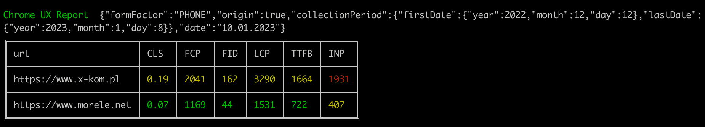

# kruk - a command line tool for [CrUX REST API](https://developers.google.com/web/tools/chrome-user-experience-report/api/guides/getting-started)

## Requirments
	
- Current version of Node.js
- Chrome UX Report Api Key: https://developers.google.com/web/tools/chrome-user-experience-report/api/guides/getting-started#APIKey

## Instalation

	npm install -g kruk

## Usage
	➜  kruk --help

	--key                     CrUX API key (required) (https://developers.google.com/web/tools/chrome-user-experience-report/api/guides/getting-started#APIKey)
	--urls                    one or more comma seperated urls  (required)
	--formFactor              allowed values: ALL_FORM_FACTORS, DESKTOP, TABLET, PHONE (default)
	--ect                     allowed values: offline, slow-2G, 2G, 3G, 4G
	--checkOrigin             get CrUX data for origin instead of given url
	--output                  posible values: distribution, json, csv, table (default)

	Usage:
	kruk --key [YOUR_API_KEY] --urls www.google.com,www.bing.com --ect 4G
	kruk --key [YOUR_API_KEY] --urls www.google.com,www.bing.com
	kruk --key [YOUR_API_KEY] --urls www.google.com
	kruk --key [YOUR_API_KEY] --urls www.google.com --checkOrigin
	kruk --key [YOUR_API_KEY] --urls www.google.com,www.bing.com --formFactor DESKTOP
	kruk --key [YOUR_API_KEY] --urls www.google.com,www.bing.com --formFactor TABLET --ect 3G

## Example output

### table

	➜  kruk --key [YOUR_API_KEY] --urls www.x-kom.pl,www.morele.net --checkOrigin

### distribution

	➜  kruk --key [YOUR_API_KEY] --urls www.google.com,www.bing.com --checkOrigin --output distribution

