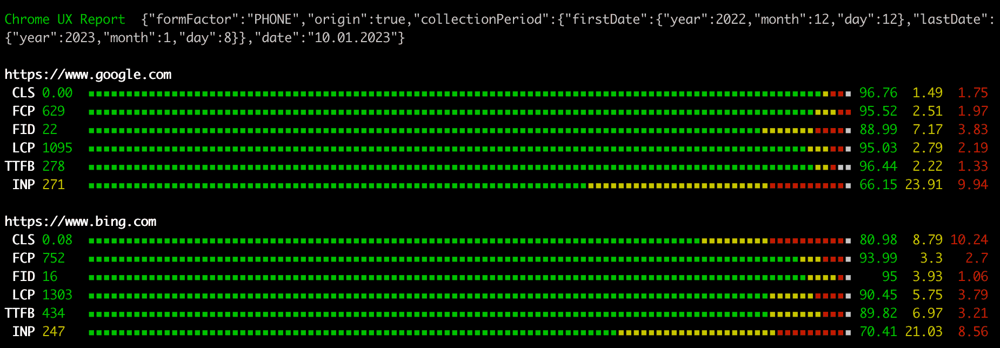

# Kruk - Chrome UX Report (CrUX) CLI Tool

Kruk is a command-line interface tool that helps you fetch and visualize Chrome User Experience Report (CrUX) data for websites. It provides easy access to real-world performance metrics collected from Chrome users.

## Installation

```bash
npm install -g kruk
```

## Usage

Basic syntax:

```bash
kruk --key YOUR_API_KEY --urls URL1,URL2 [options]
```

### Required Parameters

- `--key`: Your Google API key (Get it from [Google Cloud Console](https://developers.google.com/web/tools/chrome-user-experience-report/api/guides/getting-started#APIKey))
- `--urls`: Comma-separated list of URLs to analyze

### Optional Parameters

- `--formFactor`: Device type to filter results (default: 'PHONE')
  - Options: 'ALL_FORM_FACTORS', 'DESKTOP', 'TABLET', 'PHONE'
- `--checkOrigin`: Get data for the entire origin instead of specific URLs
- `--history`: Use CrUX history API to get historical data
- `--output`: Output format (default: 'table')
  - Options: 'distribution', 'json', 'csv', 'table'

### Examples

1. Basic usage with multiple URLs:

```bash
kruk --key YOUR_API_KEY --urls www.google.com,www.bing.com
```

3. Check desktop metrics:

```bash
kruk --key YOUR_API_KEY --urls www.google.com,www.bing.com --formFactor DESKTOP
```

4. Get origin-level data:

```bash
kruk --key YOUR_API_KEY --urls www.google.com --checkOrigin
```

5. Get data for tablet users on 3G:

```bash
kruk --key YOUR_API_KEY --urls www.google.com,www.bing.com --formFactor TABLET --ect 3G
```

## Output Metrics

The tool provides data for the following Core Web Vitals and additional metrics:

- CLS (Cumulative Layout Shift)
- FCP (First Contentful Paint)
- LCP (Largest Contentful Paint)
- TTFB (Time to First Byte)
- INP (Interaction to Next Paint)
- RTT (Round Trip Time)

## Output Formats

1. **Table** (default): Displays data in a formatted table
2. **Distribution**: Shows visual distribution of metrics using unicode characters
3. **CSV**: Outputs data in CSV format for further processing
4. **JSON**: Raw JSON output of the data

### Examples / Screenshots

Table output:


Distribution output:



## Programmatic Usage

Kruk can also be used as a module in your Node.js applications.

### Installation

```bash
npm install kruk
```

### Basic Usage

```javascript
import { getReports } from "kruk";

async function fetchCruxData() {
  const urls = ["www.google.com", "www.bing.com"];
  const API_KEY = "YOUR_API_KEY";

  const params = {
    formFactor: "PHONE", // optional
    origin: false, // optional, set true for origin-level data
    history: false, // optional, set true for historical data
  };

  try {
    const data = await getReports(urls, API_KEY, params);
    console.log(data);
  } catch (error) {
    console.error(error);
  }
}
```

### Response Structure

The response will include metrics data in the following format:

```javascript
{
  params: {
    // Query parameters used
  },
  metrics: [
    {
      url: "https://www.example.com",
      CLS: {
        p75: number,
        rank: "good" | "average" | "poor",
        histogram: [number, number, number] // Distribution values
      },
      FCP: {
        // Similar structure as CLS
      },
      LCP: {
        // Similar structure as CLS
      },
      TTFB: {
        // Similar structure as CLS
      },
      INP: {
        // Similar structure as CLS
      },
      RTT: {
        // Similar structure as CLS
      }
    }
  ]
}
```

## Requirements

- Node.js
- Google API Key with access to Chrome UX Report API

## Note

The tool requires a valid Google API key with access to the Chrome UX Report API. Make sure to handle the API key securely and not share it in public repositories.
